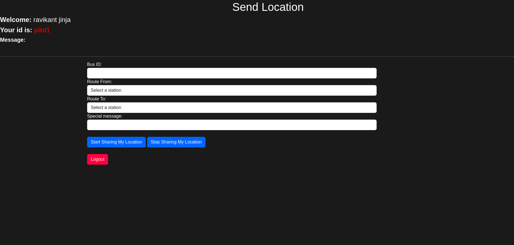
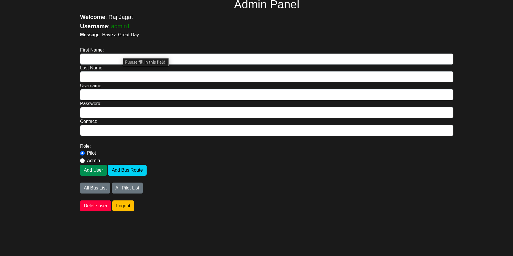
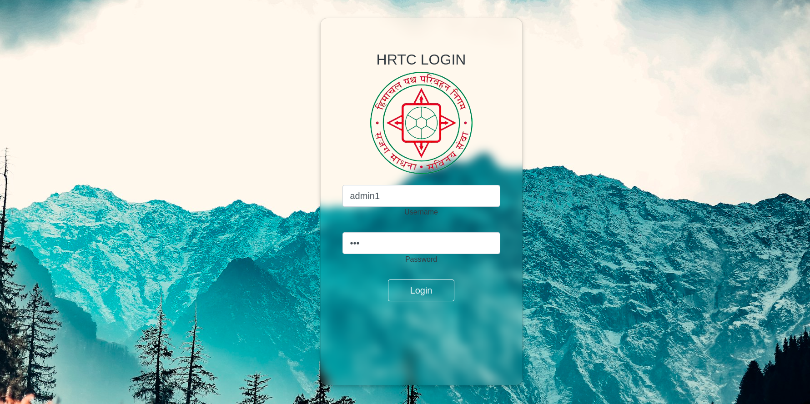
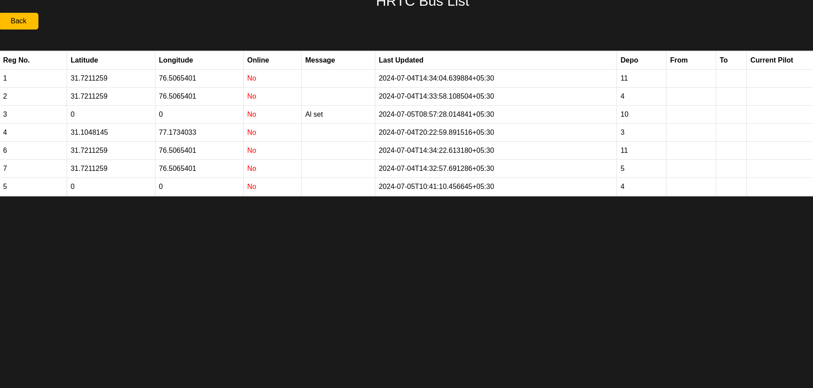

# HRTC Bus Location Tracker

## Overview

HRTC Bus Location Tracker is a web application designed to track the locations of buses in real-time. The project consists of a frontend built using Django and a backend built using Flask and HTML, CSS, and JavaScript. The system allows bus drivers to log in, share their location, and let users track buses in real-time. The admin panel provides functionalities for creating, deleting, and managing buses, pilots, and admins.

## Features

- **Driver Portal**: Bus drivers can log in and start sharing their location.
- **Real-Time Tracking**: Users can fetch and view the live location of buses.
- **Admin Panel**: Admins can create, delete, and manage buses, pilots, and admins.

## Screenshots

### Driver Portal


### Admin Panel


### Login Portal


### All Bus List


## Running the Project

### Prerequisites

- Docker
- Docker Compose

### Setup

1. Clone the repository:
    ```sh
    git clone <repository-url>
    cd project-directory
    ```

2. Build and run the project using Docker Compose:
    ```sh
    sudo docker-compose up
    ```

<!-- 3. Setting up 1st admin. (needed)
  - 1. Enter the docker container
    ```sh
    sudo docker ps -a
    sudo docker exec -it <container id> sh
    ```
  - 2. Run following commands inside container
    ```sh
    python3 manage.py makemigrations
    python3 manage.py migrate
    python3 manage.py createsuperuser --username <username>
    #Exit the container now 
    exit
    ```
  - 3. **Login superuser, by API call only.**
    * **call** `POST` `http://localhost/api/login/`
    * **body:** `{"username":"username","password":"password"}`
    * From there copy the acces token "access". 
  - 4. **Create new user by API call only.**
    * **call** `POST` `http://localhost/api/users/`
    * **body:** `{"username":"new_username","password":"password"}`
    * **header:** `Authorization: Token <access token>`
  - 5. Add the newly created user to Employee by Django Admin Pannel.
  - 6. Done. -->


### Accessing the Application

- **Backend**: Runs on `http://localhost:5000`
- **Frontend**: Runs on `http://localhost:5500`
- **APIs Documentation**: Access at `http://localhost:5000/swagger/` or `http://localhost:5000/redoc`

## License

This project is licensed under an open-source license. Contributions are welcome, but the project cannot be reused without permission.

## Contributing

All contributions are welcome. Please fork the repository and submit a pull request for any features, bug fixes, or enhancements.

## Contact

For any inquiries or issues, please contact dhimanparas20@gmail.com.
